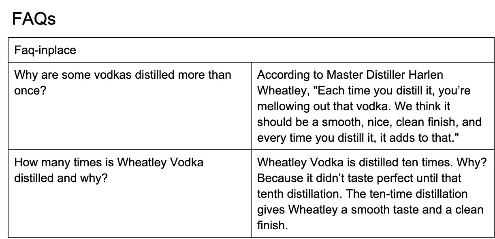
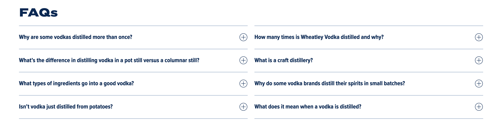
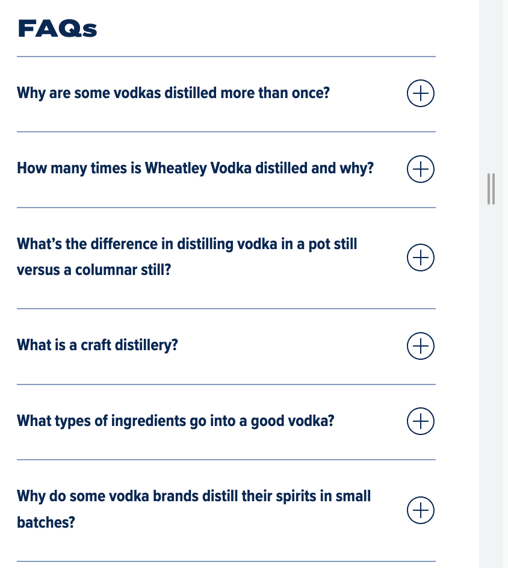

## FAQ

generates FAQ's block with toggle on/off logic

### Content Structure

| Faq-inplace |        |
|-------------|--------|
| question    | answer |
| question    | answer |
| ...         | ...    |

### Example

#### Desktop

#### Mobile

