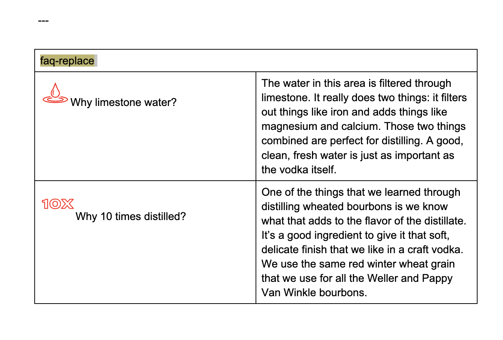
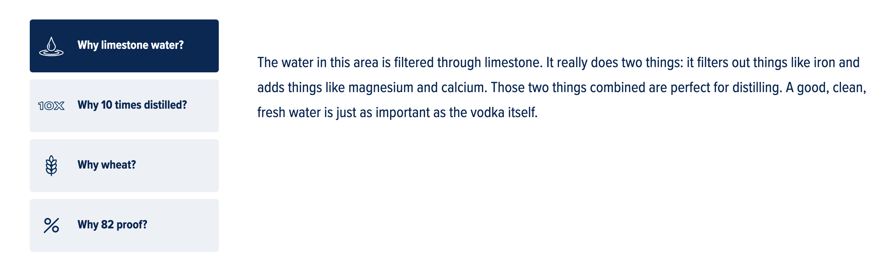

## FAQ

generates FAQ's block with replace logic (answer is always shown at the same place)

### Content Structure

| Faq-inplace    |        |
|----------------|--------|
| (img) question | answer |
| (img) question | answer |
| ...            | ...    |

### Example

#### Desktop

#### Mobile

