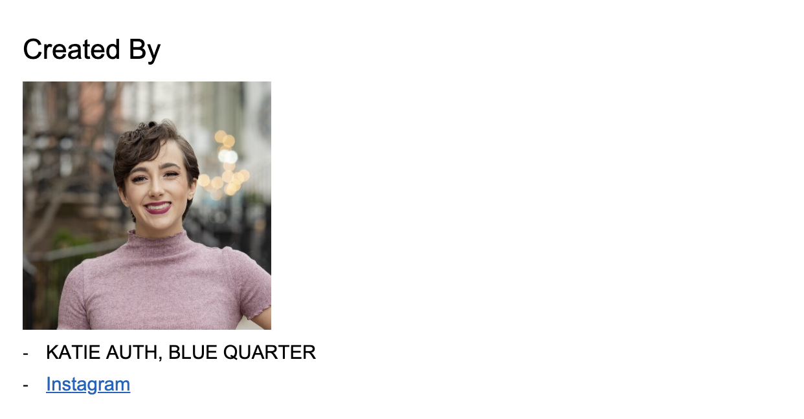
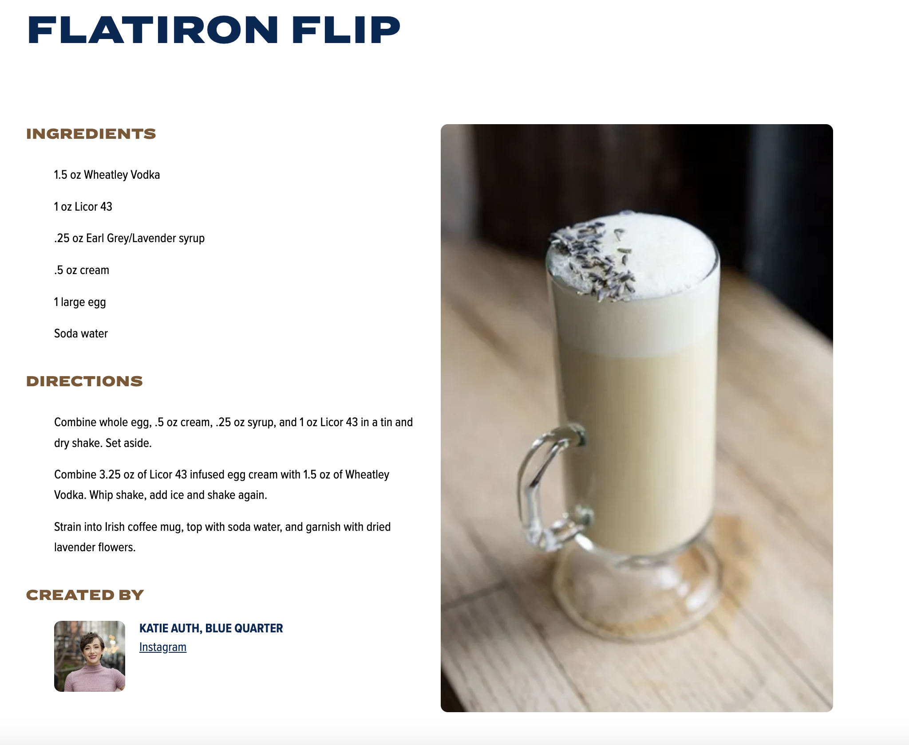

## Recipes

Recipes with ingredients and directions including image. Every Recipe is defined as single document under
/coctails/ and uses the block **cocktail** from /template/cocktail.docx template for generating the html (Sharepoint).

### Content Structure

Title with image, Incredients, Directions, Creator

title (h1) (img) text (h2) list text (h2) list text (h2) (img) (ul)(li)creartor(li)(a)  

### Template

### Example

#### Desktop

#### Mobile

